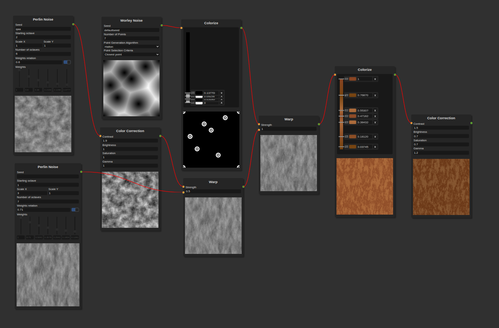

# Texturemaker

Procedural texture generator with nodes.

This project is made using Angular 17 and Electron.

## To run

Run `npm install` to install the dependencies and then `npm start` to run the application.

